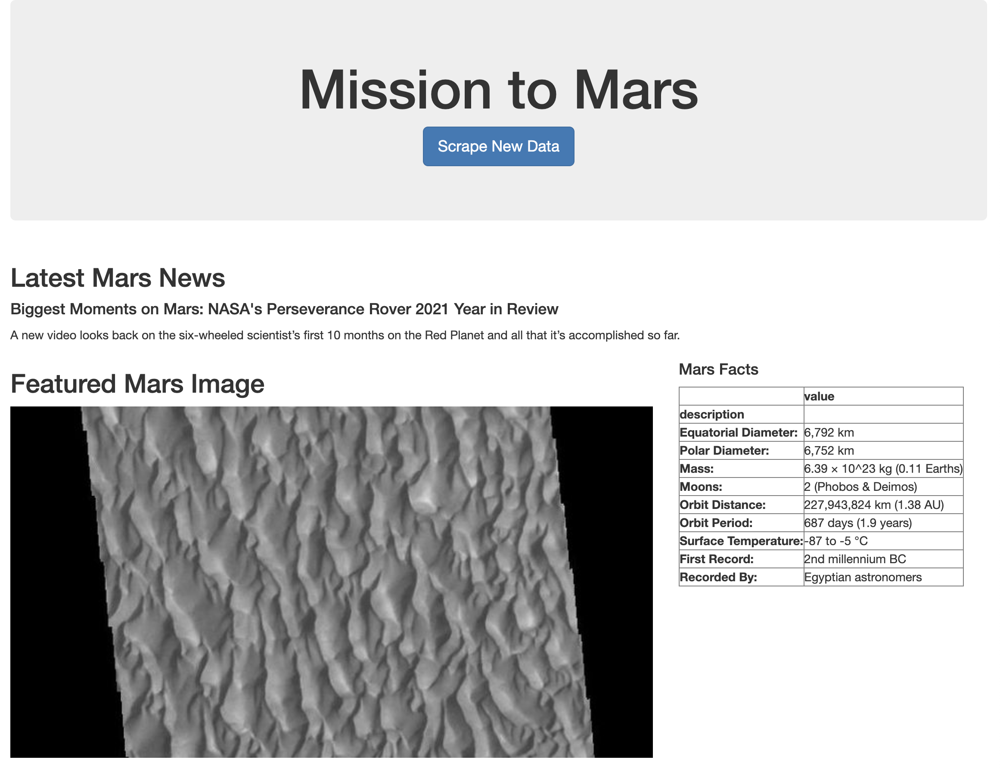

# Web Scraping Challenge - Mission to Mars

In this assignment, I have developed a web application that scrapes various websites for data, related to the Mission to Mars and displays the information in a single HTML page. 

- - -

## Step 1 - Scraping

Completed your initial scraping using Jupyter Notebook, BeautifulSoup, Pandas, and Requests/Splinter. The following outlines what I scraped:

### NASA Mars News

* Scraped the [NASA Mars News Site](https://mars.nasa.gov/news/) and collected the latest News Title and Paragraph Text. Assigned the text to variables that I can reference later.

### JPL Mars Space Images - Featured Image

* Visited the url for JPL Featured Space Image [here](https://data-class-jpl-space.s3.amazonaws.com/JPL_Space/index.html).

* Used splinter to navigate the site and find the image url for the current Featured Mars Image and assigned the url string to a variable called `featured_image_url`.

* Made sure to find the image url to the full size `.jpg` image.

* Made sure to save a complete url string for this image.

### Mars Facts

* Visited the Mars Facts webpage [here](https://space-facts.com/mars/) and used Pandas to scrape the table containing facts about the planet including Diameter, Mass, etc.

* Used Pandas to convert the data to a HTML table string.

### Mars Hemispheres

* Visited the USGS Astrogeology site [here](https://astrogeology.usgs.gov/search/results?q=hemisphere+enhanced&k1=target&v1=Mars) to obtain high resolution images for each of Mars' hemispheres.

* I created a syntax that would click each of the links to the hemispheres in order to find the image url to the full resolution image.

* Saved both the image url string for the full resolution hemisphere image, and the Hemisphere title containing the hemisphere name. Used a Python dictionary to store the data using the keys `img_url` and `title`.

* Appended the dictionary with the image url string and the hemisphere title to a list. This list contains one dictionary for each hemisphere.

- - -

## Step 2 - MongoDB and Flask Application

Used MongoDB with Flask templating to create a new HTML page that displays all of the information that was scraped from the URLs above. Used Bootstrap to structure your HTML template.

My final application looks as follows:

- - -

## Step 3 - Submission

Submission includes:

1. The Jupyter Notebook containing the scraping code used.

2. Screenshots of my final application.

3. Submission of the link to my repository to BootCampSpot.

### Copyright

Trilogy Education Services © 2021. All Rights Reserved.